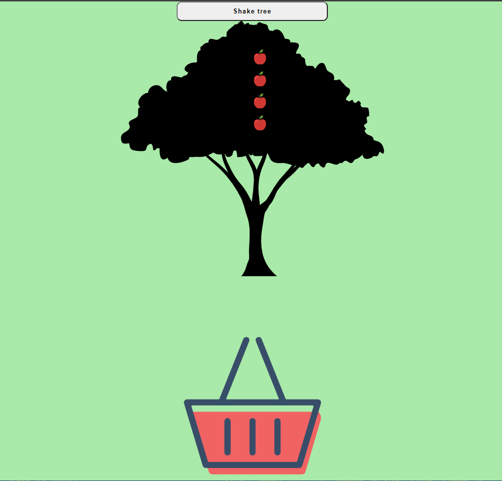
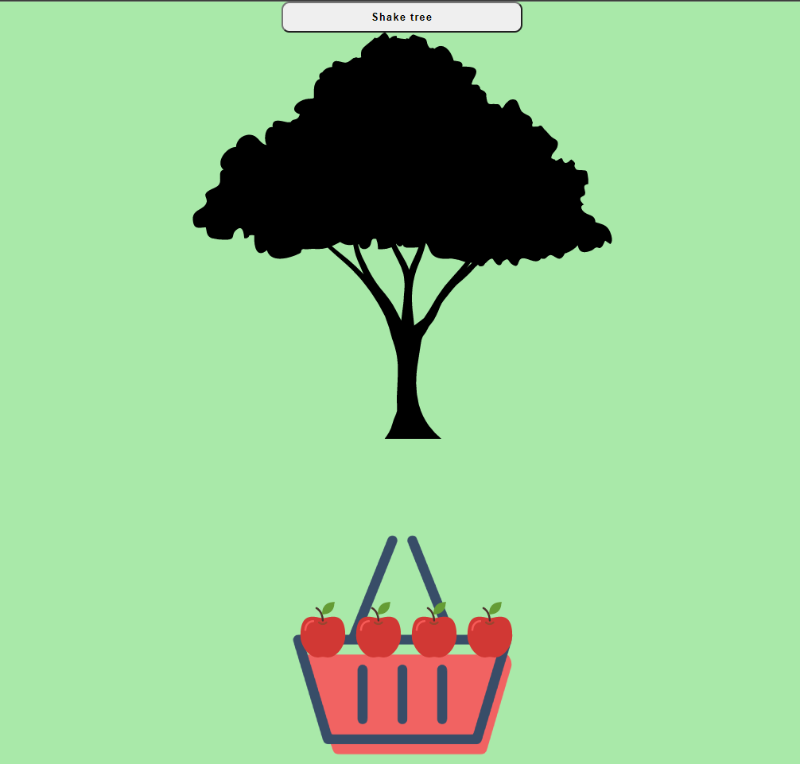

# Shaking Tree App

This project was done with React Hooks, with using state-setState and props. 
Also, I used Gulp.js to write SCSS.


## Screen




## Setup

```
git clone https://github.com/ecsabanci/shakingTree.git

cd shakingTree

npm install
npm start
```
